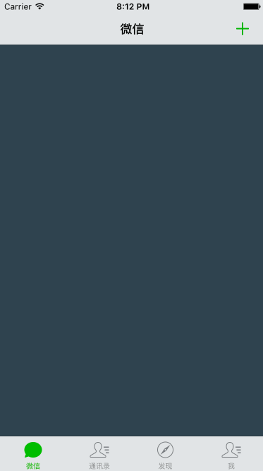
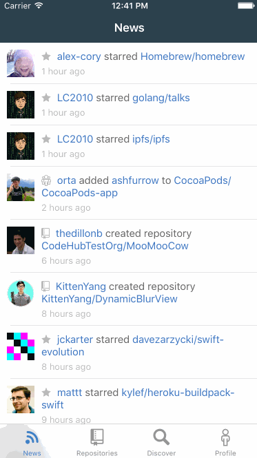

# WXTabBarController

[](https://raw.githubusercontent.com/leichunfeng/WXTabBarController/master/LICENSE)
[](http://cocoadocs.org/docsets/WXTabBarController)
[](http://cocoadocs.org/docsets/WXTabBarController)

单手操作 iPhone 6 Plus 切换 TabBar 一直是一件很痛苦的事情，而滑动切换是一种不错的解决方案，希望这种交互方式能够得到广泛地应用。

# GIF



# CocoaPods

你可以通过 `CocoaPods` 来安装 `WXTabBarController` ：

``` objc
pod 'WXTabBarController', '~> 0.1'
```

# Usage

`WXTabBarController` 的用法与系统 `UITabBarController` 的用法是完全一致的：

``` objc
- (BOOL)application:(UIApplication *)application didFinishLaunchingWithOptions:(NSDictionary *)launchOptions {
    self.window = [[UIWindow alloc] initWithFrame:[UIScreen mainScreen].bounds];

    self.window.rootViewController = self.navigationController;
    [self.window makeKeyAndVisible];
    
    return YES;
}

- (UINavigationController *)navigationController {
    if (_navigationController == nil) {
        UINavigationController *navigationController = [[UINavigationController alloc] initWithRootViewController:self.tabBarController];
        navigationController.navigationBar.tintColor = [UIColor colorWithRed:26 / 255.0 green:178 / 255.0 blue:10 / 255.0 alpha:1];
        _navigationController = navigationController;
    }
    return _navigationController;
}

- (WXTabBarController *)tabBarController {
    if (_tabBarController == nil) {
        WXTabBarController *tabBarController = [[WXTabBarController alloc] init];
        
        ViewController *mainframeViewController = ({
            ViewController *mainframeViewController = [[ViewController alloc] init];
            
            UIImage *mainframeImage   = [UIImage imageNamed:@"tabbar_mainframe"];
            UIImage *mainframeHLImage = [UIImage imageNamed:@"tabbar_mainframeHL"];
            
            mainframeViewController.title = @"微信";
            mainframeViewController.tabBarItem = [[UITabBarItem alloc] initWithTitle:@"微信" image:mainframeImage selectedImage:mainframeHLImage];
            mainframeViewController.view.backgroundColor = [UIColor colorWithRed:48 / 255.0 green:67 / 255.0 blue:78 / 255.0 alpha:1];
            mainframeViewController.navigationItem.rightBarButtonItem = [[UIBarButtonItem alloc] initWithImage:[UIImage imageNamed:@"barbuttonicon_add"]
                                                                                                         style:UIBarButtonItemStylePlain
                                                                                                        target:self
                                                                                                        action:@selector(didClickAddButton:)];
            
            mainframeViewController;
        });
        
        ViewController *contactsViewController = ({
            ViewController *contactsViewController = [[ViewController alloc] init];
            
            UIImage *contactsImage   = [UIImage imageNamed:@"tabbar_contacts"];
            UIImage *contactsHLImage = [UIImage imageNamed:@"tabbar_contactsHL"];
            
            contactsViewController.title = @"通讯录";
            contactsViewController.tabBarItem = [[UITabBarItem alloc] initWithTitle:@"通讯录" image:contactsImage selectedImage:contactsHLImage];
            contactsViewController.view.backgroundColor = [UIColor colorWithRed:115 / 255.0 green:155 / 255.0 blue:6 / 255.0 alpha:1];
            
            contactsViewController;
        });
        
        ViewController *discoverViewController = ({
            ViewController *discoverViewController = [[ViewController alloc] init];
            
            UIImage *discoverImage   = [UIImage imageNamed:@"tabbar_discover"];
            UIImage *discoverHLImage = [UIImage imageNamed:@"tabbar_discoverHL"];
            
            discoverViewController.title = @"发现";
            discoverViewController.tabBarItem = [[UITabBarItem alloc] initWithTitle:@"发现" image:discoverImage selectedImage:discoverHLImage];
            discoverViewController.view.backgroundColor = [UIColor colorWithRed:32 / 255.0 green:85 / 255.0 blue:128 / 255.0 alpha:1];
            
            discoverViewController;
        });
        
        ViewController *meViewController = ({
            ViewController *meViewController = [[ViewController alloc] init];
            
            UIImage *meImage   = [UIImage imageNamed:@"tabbar_me"];
            UIImage *meHLImage = [UIImage imageNamed:@"tabbar_meHL"];
            
            meViewController.title = @"我";
            meViewController.tabBarItem = [[UITabBarItem alloc] initWithTitle:@"我" image:meImage selectedImage:meHLImage];
            meViewController.view.backgroundColor = [UIColor colorWithRed:199 / 255.0 green:135 / 255.0 blue:56 / 255.0 alpha:1];
            
            meViewController;
        });******
        
        tabBarController.title = @"微信";
        tabBarController.tabBar.tintColor = [UIColor colorWithRed:26 / 255.0 green:178 / 255.0 blue:10 / 255.0 alpha:1];

        tabBarController.viewControllers = @[
            [[UINavigationController alloc] initWithRootViewController:mainframeViewController],
            [[UINavigationController alloc] initWithRootViewController:contactsViewController],
            [[UINavigationController alloc] initWithRootViewController:discoverViewController],
            [[UINavigationController alloc] initWithRootViewController:meViewController],
        ];
        
        _tabBarController = tabBarController;
    }
    return _tabBarController;
}
```

唯一一个需要注意的地方是，整个应用是由 `WXTabBarController` 的 `navigationController` 来进行导航的，而不是 `Tab` 页自己的 `navigationController` ：

``` objc
- (void)didClickAddButton:(id)sender {
    ViewController *viewController = [[ViewController alloc] init];
    
    viewController.title = @"添加";
    viewController.view.backgroundColor = [UIColor colorWithRed:26 / 255.0 green:178 / 255.0 blue:10 / 255.0 alpha:1];
    
    [self.navigationController pushViewController:viewController animated:YES];
}
```

为了更直观地理解这个约定，我们一起来看一下整个应用的导航层次结构图：


# Application

目前，`WXTabBarController` 已经在 [MVVMReactiveCocoa](https://github.com/leichunfeng/MVVMReactiveCocoa) 中正式使用，效果如下：



# Contribution

如果你有兴趣为这个库贡献代码的话，请先 `Fork` 这个库，然后在自己的库上做修改，最后提交 `Pull request` :

``` objc
git clone https://github.com/your-username/WXTabBarController.git
cd WXTabBarController
pod install
```

# License

WXTabBarController is available under the MIT license. See the [LICENSE](LICENSE) file for more info.
